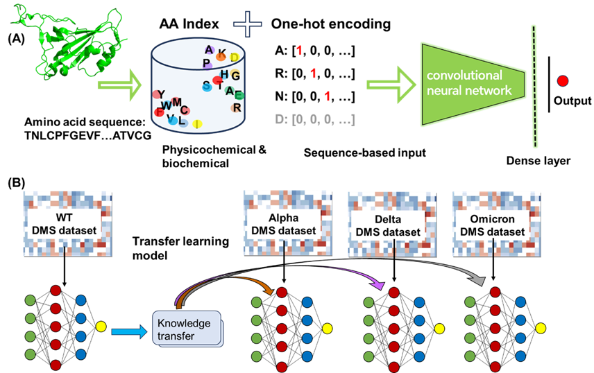

# CNN models for deep mutational scanning data

This repository is a supplement to our paper:  
[Machine Learning on the Impacts of Mutations in the SARS-CoV-2 Spike RBD on Binding Affinity to Human ACE2 based on Deep Mutational Scanning Data](https://pubs.acs.org/doi/10.1021/acs.biochem.4c00587).


 
## Environment setup
This code is based on Python 3.6 and TensorFlow 2.5.0. 
Use the provided [environment.yml](environment.yml) file to set up an environment.

```
conda env create -f environment.yml
conda activate cnn4dms
```

If you have Nvidia GPUs and your environment are properly set up for GPU support, the training will be running on GPU automatically. 

The encoding part of this code is from [nn4dms](https://github.com/gitter-lab/nn4dms/tree/master).
## Train a model
You can train a model by calling [run.py](run.py) with the required arguments specifying the sequence, offset, DMS data file and mode.

#### Note: The DMS data file should follow the same format as the one given in [examples](examples).

Run the following command from to train a CNN model on the example DMS dataset:
```
python run.py \
    --seq TEYKLVVVGACGVGKSALTIQLIQNHFVDEYDPTIEDSYRKQVVIDGETCLLDILDTAGQEEYSAMRDQYMRTGEGFLCVFAINNTKSFEDIHHYREQIKRVKDSEDVPMVLVGNKCDLPSRTVDTKQAQDLARSYGIPFIETSAKTRQGVDDAFYTLVREIRKHKEKMSKDGKKKKKKSKTKCVIM \
    --offset 2 \
    --dms_file ./examples/KRASG12C.csv \
    --mode default
```
By runing this command, a CNN model will be built and trained on the given DMS dataset. The trained model and predictions on the data set will automatically be stored in the [models](models) and [results](results) directory respectively.


For a full list of parameters, call `python run.py -h`.

## Inference
If you already have a CNN model, you may make inference on other DMS data by calling [run.py](run.py) with specifying inference arguments.
```
python run.py \
    --seq TEYKLVVVGACGVGKSALTIQLIQNHFVDEYDPTIEDSYRKQVVIDGETCLLDILDTAGQEEYSAMRDQYMRTGEGFLCVFAINNTKSFEDIHHYREQIKRVKDSEDVPMVLVGNKCDLPSRTVDTKQAQDLARSYGIPFIETSAKTRQGVDDAFYTLVREIRKHKEKMSKDGKKKKKKSKTKCVIM \
    --offset 2 \
    --dms_file ./examples/KRASG12C.csv \
    --mode inference \
    --model_file ./models/KRASG12C.h5
```
